# PRÁCTICA 1
## **INTALACION DE DOCKER EN DEBIAN**

Para realizar el proceso de instalación se siguieron los pasos tal cual como lo indica la pagina oficial de docker:

- [enlace instalación docker en debian](https://docs.docker.com/engine/install/debian/) 

## **Instalación de de python 3.8:**

Al revisar la version de python en debian no estaba instalada la 3.8, por lo tanto se realiza el proceso de actualización teniendo en cuenta el siguiente enlace:

- [Enlace instalar python 3.8 en debian](https://linuxize.com/post/how-to-install-python-3-8-on-debian-10/)

Finalmente verificamos la correcta instalación a través del siguiente comando:

- python3.8 --version

## **Conexión cliente servidor con python** 

Para llevar a cabo esta sección se implementan dos script con lenguaje de programación python denominados server.py y client.py, los cuales permitirán una conexión a través del protocolo TCP, los códigos implementados se tomaron en base al siguiente enlace:

- [TCP client-server python script](https://rico-schmidt.name/pymotw-3/socket/tcp.html)

A continuación podemos ver la correcta ejecución del server.py

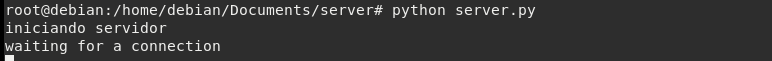

Al ejecutar el client.py se establece la conexión, donde se puede observar el compartiendo desde el servidor y el cliente como se muestra a continuación:

- Ejecución desde server.py

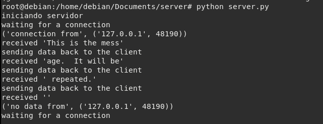

- Ejecución desde client.py

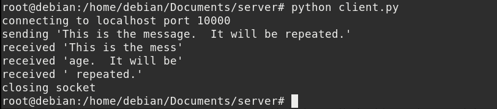

También es importante conocer la utilidad de **lsof**, ya que permite observar una una lista de archivos y procesos abiertos que se estén ejecutando, relevante al momento de realizar pruebas con diferentes servicios.

para mas información se puede visitar el siguiente link:

- [como usar lsof en linux](https://help.clouding.io/hc/es/articles/5797810889500-C%C3%B3mo-usar-el-comando-lsof-en-Linux#:~:text=lsof%20significa%20%22list%20open%20files,similar%20a%20netstat%20o%20ss.)

## **Conexión cliente servidor desde computador windows a servidor debian**

Se pretende realizar una conexión por medio del protocolo TCP entre windows y debian, para ello se realiza un proceso edición en el script de python tanto del lado del cliente (windows), como del servidor (debian):

- script python lado del cliente (windows)

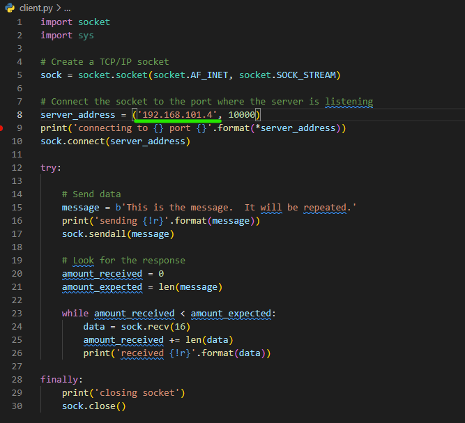

- script python lado del servidor (debian); tener en cuenta colocar la dirección ip 0.0.0.0, ya que indica que puede comunicarse con cualquier dispositivo que se dirige al puerto 10000:

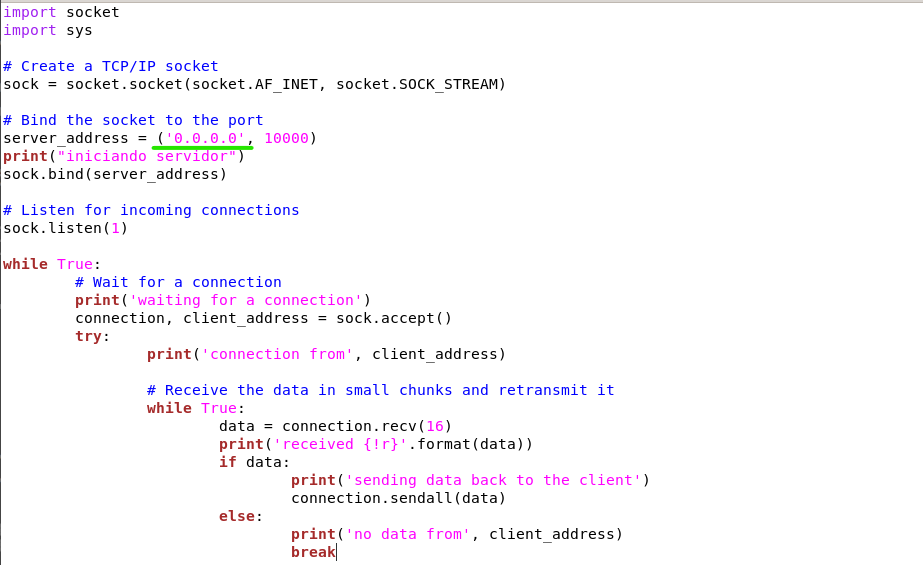

AL verificar la conexión del lado del servidor nos muestra la dirección ip del lado del cliente:

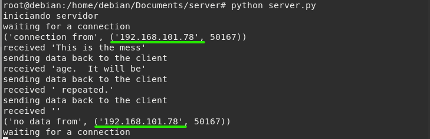

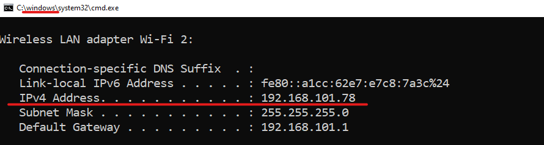

# PRÁCTICA 2

El primer paso es instalar el servidor NodeJS y NestJS en la maquina debian, a continuación se compruebra la instalación:

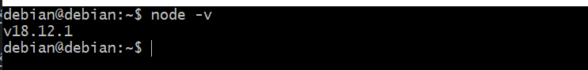

Luego se crea un proyecto NestJS, con el comando **nest new nombre-proyecto**, donde se crea una carpeta con los siguientes archivos:

Dentro de los archivos se encuentra ___package.json___ que permite observar la estructura de datos del proyecto:

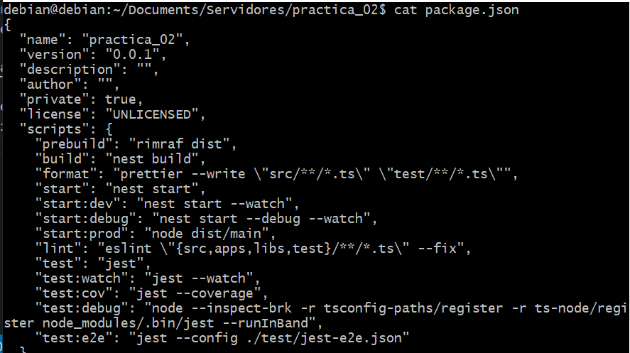

para iniciar el ejemplo Hello World se ejecuta el comando ___npm run start:dev___, mostrando el siguiente resultado:

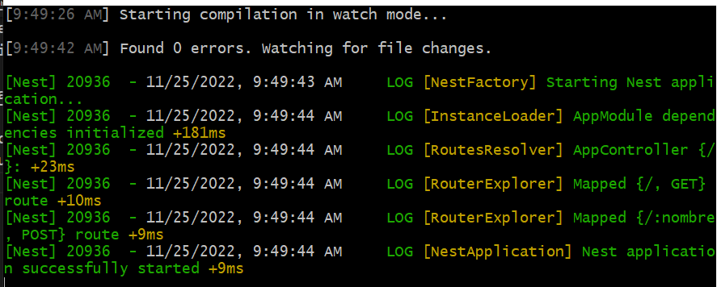

para comprobar su ejecución también se puede observar el puerto disponible, que para este caso de estudio es el 3000:

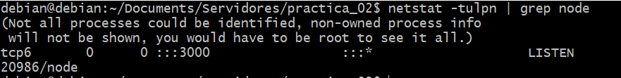

Al ingresar la dirección se puede observar el correcto funcionamiento con la salida ___Hello World___ en el navegador:

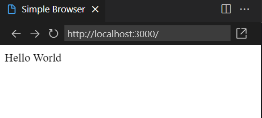

También se puede observar la salida mostrando la dirección ip de la maquina (___192.168.101.4:3000___):

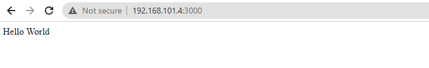

## ***Los verbos HTTP:***

Para trabajas con mayor comodidad se se accede a los archivos de la maquina linux a través de Remote SSH en Visual Studio Code:

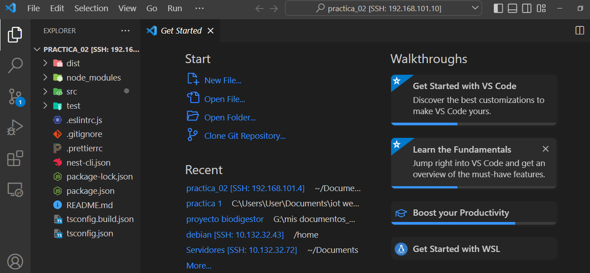

Modificación del archivo `app.controller.ts` para colocar el mensaje `Hola Richard Sanchez`, que se ejecutara por defecto debido al método @GET():

Al ejecutarlo en el navegador se observa los siguiente:

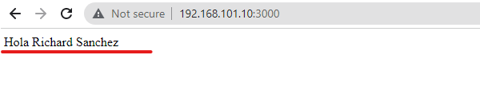

### ___Método POST___

Este método permite realizar una modificación al invocarlo, por lo tanto, se agrega a través de @POST() con el objetivo de modificar la palabra nombre:  

    import { Controller, Get, Param, Post } from '@nestjs/common';
    import { AppService } from './app.service';

    @Controller()
    export class AppController {
        constructor(private readonly appService: AppService) {}

    private persona = "Mundo";

    @Get()
        getHello(): string {
        return `Hola: ${this.persona}`
    }

    @Post(':nombre')
        modificar(@Param('nombre') nombre: string): string {
        this.persona = nombre;
        return `Mensaje modificado: ${this.persona}`
    }
    }

A continuación se modifica a través del método @POST(), el nombre a `MESSI`:

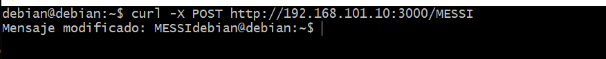

En el navegador se puede comprobar el cambio por medio del método @GET():

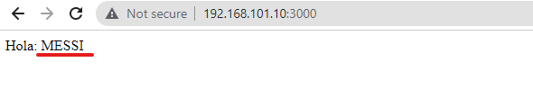

### ___Crud para modificar una entidad (implementación verbos HTTP)___

Para verificar cada uno de los verbos se crea un objeto denominado `Computador` el cual tiene los siguientes atributos; color, marca, ramGB. La validación de cada verbo se hará través de `POSTMAN`. El archivo `app.controller.ts`, es el siguiente:

    import { Body, Controller, Delete, Get, Param, Patch, Post, Put } from '@nestjs/common';
    import { AppService } from './app.service';

    interface Computador {
    color: string,
    marca: string,
    ramGB: number
    }

    @Controller()
    export class AppController {
    constructor(private readonly appService: AppService) { }

    private computadores: Computador[] = [{
        color: "negro",
        marca: "hp",
        ramGB: 12
    }]

    @Get()
    getHello(): Computador[] {
        return this.computadores;
    }

    @Post()
    crear(@Body() datos: Computador): Computador {
        this.computadores.push(datos);
        return datos;
    }

    @Put(":id")
    modificar(@Body() datos: Computador, @Param('id') id: number): Computador | string {
        try {
        this.computadores[id] = datos
        return this.computadores[id];
        }
        catch {
        return `No fue posible modificar el computador en la posición ${id}`
        }
    }

    @Delete(":id")
    eliminar(@Param('id') id: number) {
        try {
        this.computadores = this.computadores.filter((val, index) => index != id);
        return true;
        }
        catch {
        return false;
        }
    }

    @Patch(":id/ramGB/:ramGB")
    cambiarEdad(@Param('id') id: number, @Param('ramGB') ramGB: number): Computador | string {
        try {
        this.computadores[id].ramGB = ramGB;
        return this.computadores[id];
        }
        catch {
        return `No fue posible modificar al computador en la posición ${id}`
        }
    }
    }

### Método GET

Permite observar los atributos del objeto creado `Computador` al realizar la ejecución con la url:

Algo similar se logra observar con el software `Postman`:

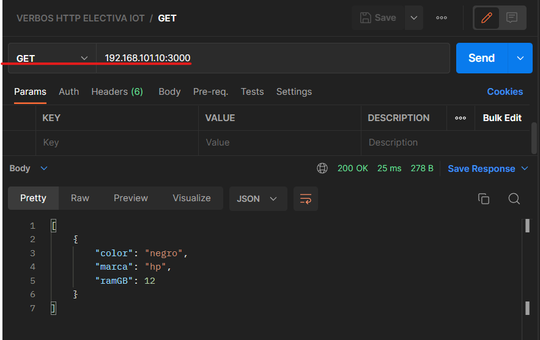
 
### Método POST

Vamos a crear un nuevo recurso, es decir un computador por medio de un archivo `json`:

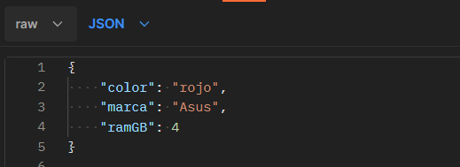

Ahora con la ayuda de `Postman`, accedemos al link con el método POST que actualiza el objeto computador en base al archivo json:

Para verificar la actualización accedemos al link con el método GET:

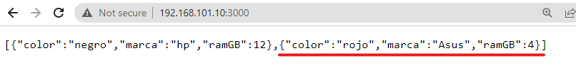

### Método PUT

Vamos actualizar por completo el Computador de la marca asus identificado con `id 1` por medio de un archivo json. A continuación se muestra el proceso de ejecución en Postman:

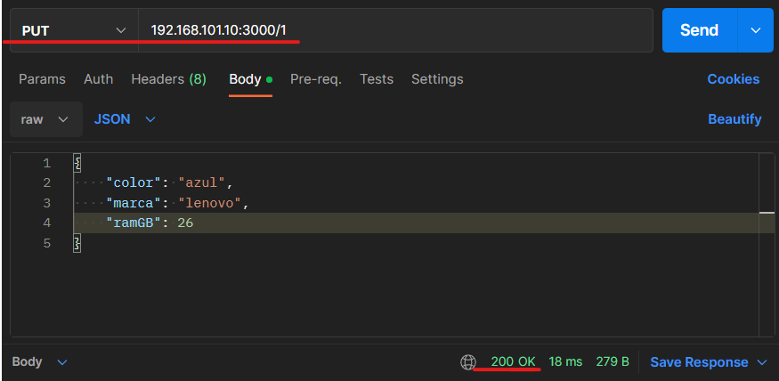

Y verificamos con el método get los cambios:

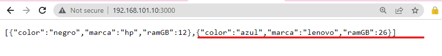

### Método DELETE

Vamos a eliminar por completo el computador que creamos inicialmente en el código, para ello se ingresa en Postman el link con la ubicación del objeto a eliminar que para nuestro caso es `0`:

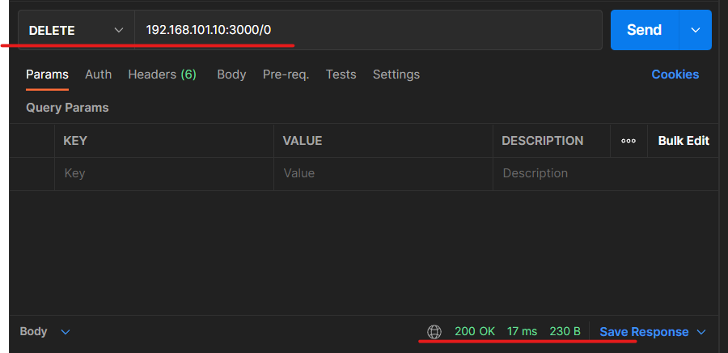

Y verificamos con el método get los cambios:

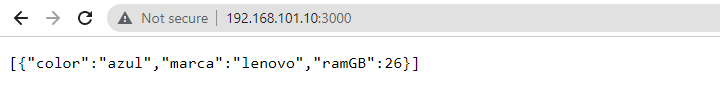

### Método PATCH

Para estudiar su funcionamiento vamos a modificar la ram del computador Lenovo a 16 GB. Para ello especificamos en el link la posición o id correspondiente al objeto creado y digitamos la ram que se quiere actualizar:

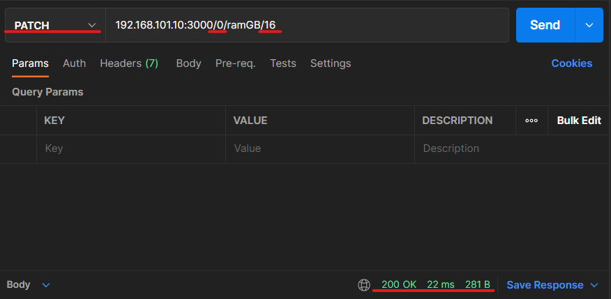

Y verificamos con el método get los cambios:

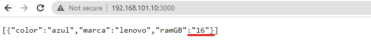

# PRÁCTICA 3

### Arquitectura Hexagonal

Para implementar la arquitectura se estructuro a partir de la entidad Computador, sin embargo, como este es muy amplio se especifica las características para un portátil:

1. Se modela los datos dentro de la carpeta models dentro de domain creando el archivo Computador de manera general `computador.ts`

        export abstract class Computador {
        color: string;
        marca: string;
        ramGB: number;
        }

2. Para extender el modelo a un portátil:

        import { Computador } from "./computador";

        export class Portatil extends Computador {
        gama: string = "No definida";
        }

3. Migrar la funcionalidad del controlador a un servicio. Proceso realizado en `portatil.service.ts` dentro de `services`:

        import { Injectable } from '@nestjs/common';
        import { Portatil } from '../models/portatil.model';

        @Injectable()
        export class PortatilService {

        private portatil: Portatil[] = [{
            color: 'negro',
            marca: 'hp',
            ramGB: 10,
            gama: 'media'
        }]

        public listar() : Portatil[] {
            return this.portatil
        }

        public crear(portatil1: Portatil): Portatil {
            this.portatil.push(portatil1);
            return portatil1;
        }

        public modificar(id: number, portatil1: Portatil): Portatil {
            this.portatil[id] = portatil1
            return this.portatil[id];
        }

        public eliminar(id: number): boolean {
            const totalportatilesAntes = this.portatil.length;
            this.portatil = this.portatil.filter((val, index) => index != id);
            if(totalportatilesAntes == this.portatil.length){
            return false;
            }
            else{
            return true;
            }
        }

        public cambiarRam(id: number, ramGB: number): Portatil {
            this.portatil[id].ramGB = ramGB;
            return this.portatil[id];
        }

        }

4. Se modifica el archivo `portatiles.controller.ts`, para implementar el servicio. Ademas, se adiciona bloques try/catch para manejar errores:

        import { Body, Controller, Delete, Get, Param, Patch, Post, Put } from '@nestjs/common';
        import { Portatil } from '../domain/models/portatil.model';
        import { PortatilService } from '../domain/services/portatil.service';

        const errReturn = (e: Error, message: string) => {
        return {
            message: message,
            error: e
        }
        }

        @Controller()
        export class PortatilController {
        constructor(private readonly portatil1Service: PortatilService) { }

        @Get()
        getHello() {
            try{
            return this.portatil1Service.listar();
            }
            catch(e){
            return errReturn(e, "Error al listar portatiles");
            }
        }

        @Post()
        crear(@Body() datos: Portatil) {
            try{
            return this.portatil1Service.crear(datos);
            }
            catch(e){
            return errReturn(e, "Error al crear portatil");
            }
        }

        @Put(":id")
        modificar(@Body() datos: Portatil, @Param('id') id: number) {
            try{
            return this.portatil1Service.modificar(id, datos);
            }
            catch(e){
            return errReturn(e, "Error al modificar portatil");
            }
        }

        @Delete(":id")
        eliminar(@Param('id') id: number) {
            try{
            return this.portatil1Service.eliminar(id);
            }
            catch(e){
            return errReturn(e, "Error al eliminar portatil");
            }
        }

        @Patch(":id/ramGB/:ramGB")
        cambiarEdad(@Param('id') id: number, @Param('ramGB') ramGB: number) {
            try{
            return this.portatil1Service.cambiarRam(id, ramGB);
            }
            catch(e){
            return errReturn(e, "Error al modificar edad del portatil");
            }
        }
        }

5. Se comprueba el funcionamiento realizando una petición GET y se realiza un commit en la rama hexagonal denominado "Arquitectura hexagonal implementada"

### Implementando seguridad:

1. Instalación del paquete `@nestjs/passport y passport`:

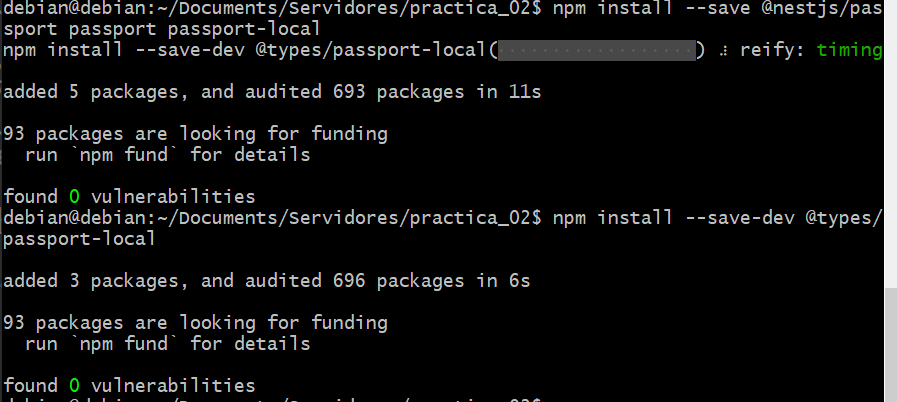

2. Se crea modulo de autenticación y usuarios con los siguientes comandos:

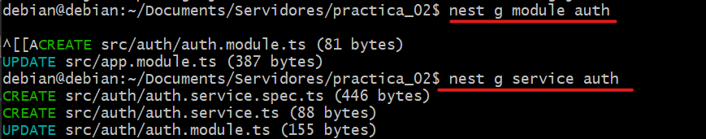

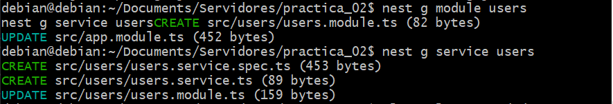

3. Los archivos y carpeta creada son los siguientes:

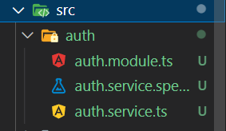

4. Implementación del servicio de usuarios en el archivo `users.service.ts`:

        import { Injectable } from '@nestjs/common';

        export type User = {
            userId: number,
            username: string,
            password: string
        };
        
        @Injectable()
        export class UsersService {
            private readonly users: User[] = [
            {
                userId: 1,
                username: 'john',
                password: 'changeme',
            },
            {
                userId: 2,
                username: 'maria',
                password: 'guess',
            },
            ];
        
            /**
            * Recupera los datos del usuario
            * @param username Nombre de usuario
            * @returns 
            */
            async findOne(username: string): Promise<User | undefined> {
            return this.users.find(user => user.username === username);
            }
        }

5. modifica el archivo `users.module.ts` para garantizar disponibilidad para otros servicios instanciados:

        import { Module } from '@nestjs/common';
        import { UsersService } from './users.service';

        @Module({
        providers: [UsersService],
        exports: [UsersService], // Exporta el servicio
        })
        export class UsersModule {}

6. Se implementa el servicio de autenticación que suele estar aislado:

import { Injectable } from '@nestjs/common';
import { UsersService } from '../users/users.service';

        @Injectable()
        export class AuthService {
        constructor(private usersService: UsersService) {}

        async validateUser(username: string, pass: string): Promise<any> {
            const user = await this.usersService.findOne(username);
            if (user && user.password === pass) {
                const { password, ...result } = user;
                return result;
            }
            return null;
        }
        }

7. Se habilita el servicio de autenticación:

        import { Module } from '@nestjs/common';
        import { AuthService } from './auth.service';
        import { UsersModule } from '../users/users.module';

        @Module({
        imports: [UsersModule], // Importa el módulo de usuarios
        providers: [AuthService]
        })
        export class AuthModule {}

8. Implementación de estrategia para validar usuario creando el archivo `local.strategy.ts` dentro de la carpeta `src/auth`:

        import { Strategy } from 'passport-local';
        import { PassportStrategy } from '@nestjs/passport';
        import { Injectable, UnauthorizedException } from '@nestjs/common';
        import { AuthService } from './auth.service';

        @Injectable()
        export class LocalStrategy extends PassportStrategy(Strategy) {
        constructor(private authService: AuthService) {
            super();
        }

        async validate(username: string, password: string): Promise<any> {
            const user = await this.authService.validateUser(username, password);
            if (!user) {
                throw new UnauthorizedException();
            }
            return user;
        }
        }

9. Se configura modulo de autenticación para utilizar la estrategia implementada anteriormente:

            import { Module } from '@nestjs/common';
            import { AuthService } from './auth.service';
            import { UsersModule } from '../users/users.module';
            import { PassportModule } from '@nestjs/passport';
            import { LocalStrategy } from './local.strategy';

            @Module({
            imports: [UsersModule, PassportModule],
            providers: [AuthService, LocalStrategy]
            })
            export class AuthModule {}

10. Finalmente se protegen los enpoints desarrollados modificando respectivamente el controlador.

11. vamos a realizar un POST para verifcar que efectivamente al no ingresar el usuario y contraseña el servidor no autoriza la modificación:

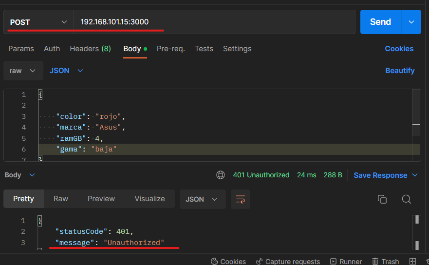

Para poder acceder y realizar modificaciones se deben ingresar las credenciales de usuairo como se muestra a continuación:

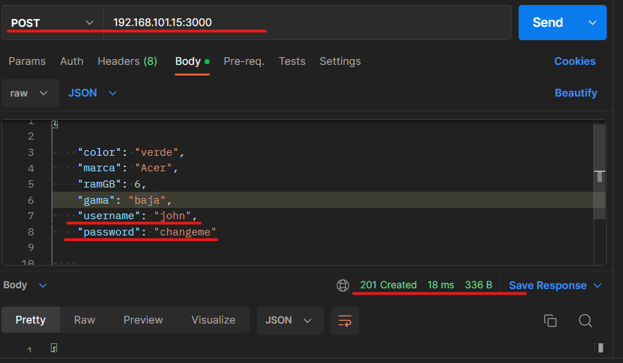

### Autenticación con JWT:

1. Realizamos el proceso de instalación del paquete jwt (`@nestjs/jwt`):

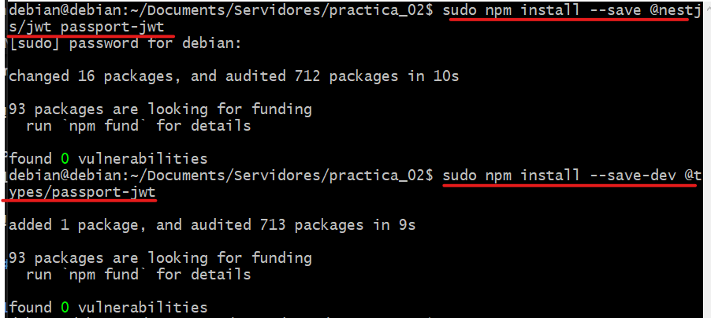

2. Modificación del archivo `auth.service.ts`:

        import { Injectable } from '@nestjs/common';
        import { JwtService } from '@nestjs/jwt';
        import { UsersService } from '../users/users.service';

        @Injectable()
        export class AuthService {
        constructor(
        private usersService: UsersService,
        private jwtService: JwtService
        ) {}

        async validateUser(username: string, pass: string): Promise<any> {
            const user = await this.usersService.findOne(username);
            if (user && user.password === pass) {
                const { password, ...result } = user;
                return result;
            }
            return null;
        }

        async login(user: any) {
            const payload = { username: user.username, sub: user.userId };
            return {
                access_token: this.jwtService.sign(payload),
            };
        }
        }

3. Se realizan los pasos correspondientes de la sesion `III. Autenticación con JWT`, desde 3 hasta el 8, que consiste en la modificación de diferentes archivos.

4. Al ejecutar el comando `curl -X POST http://localhost:3000/auth/login -d '{"username": "john", "password": "changeme" }' -H "Content-Type: application/json"`, en la terminal se puede obervar que se genera un token JWT:

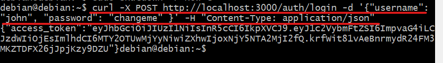

5. ahora se adicion la siguiente linea de codigo `@UseGuards(JwtAuthGuard)` en el archivo `portatiles.controller.ts` para proteger el endpoint POST:

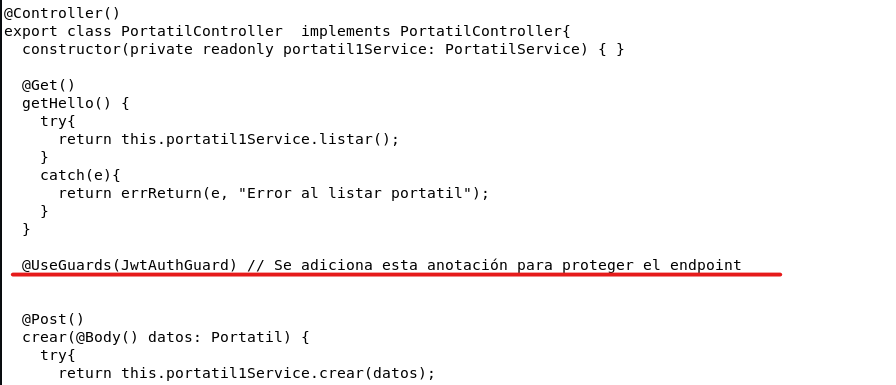

6. Ahora para comprobar su funcionamiento agregamos un nuevo computador pero ingresando el token creado anteriormente:

y verificamos la correcta creación del computador:

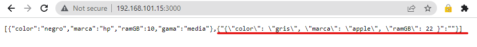

### endpoint protegidos con JWT verbo DELETE:

Vamos a eliminar el computador apple, para ello agregamos la anotación `@UseGuards(JwtAuthGuard)`, antes del metodo DELETE:

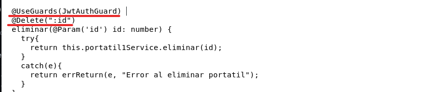

Para facilitar el trabajo utilizamos el software postman creando una variable de entorno denominada `jwt` que contiene el token:

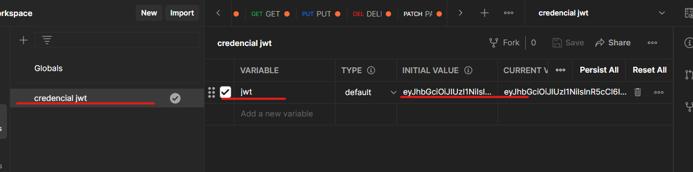

Posteriormente con el verbo DELETE, creamos en encabezado de llave autorización que tambien contiene el token:

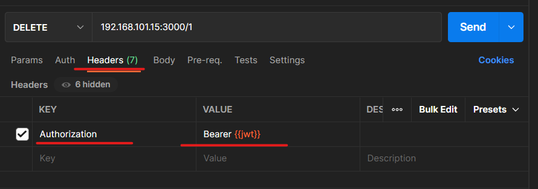

Al presionar enviar se elimina el registro en la posición 1, el resultado en postman es el siguiente:

Y verificamos en el navegador la eliminacion del registro:

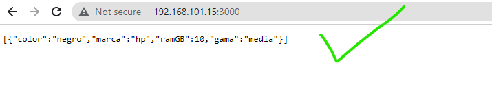

### endpoint protegidos con JWT verbo PATH:

Ahora vamos a modificar la Ram del computador de 10 GB a 30 GB, para ello agregamos `@UseGuards(JwtAuthGuard)` antes del metodo PATH:

Utilizando el encabezado de autorización y la variable de entorno dentro del metodo PATCH modificamos la ram del computador `hp` de la siguiente manera:

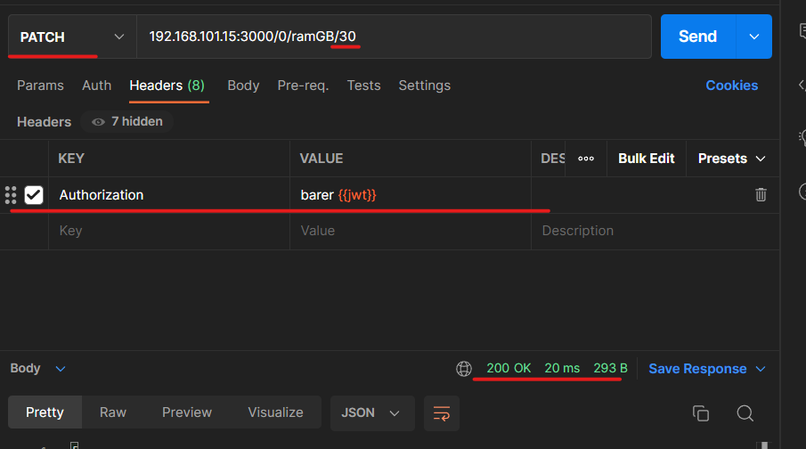

Y verificamos en el navegador el correcto cambio:

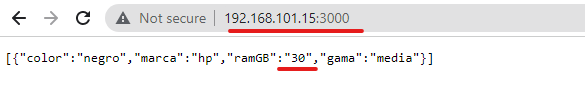

