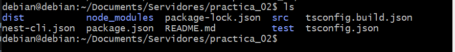
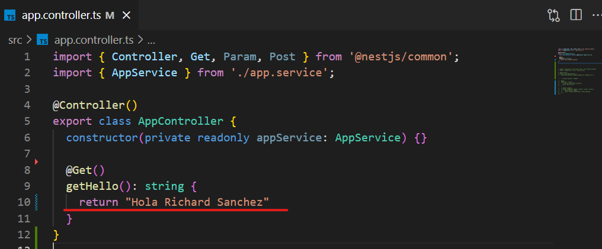

# PRÁCTICA 1
## **INTALACION DE DOCKER EN DEBIAN**

Para realizar el proceso de instalación se siguieron los pasos tal cual como lo indica la pagina oficial de docker:

- [enlace instalación docker en debian](https://docs.docker.com/engine/install/debian/) 

## **Instalación de de python 3.8:**

Al revisar la version de python en debian no estaba instalada la 3.8, por lo tanto se realiza el proceso de actualización teniendo en cuenta el siguiente enlace:

- [Enlace instalar python 3.8 en debian](https://linuxize.com/post/how-to-install-python-3-8-on-debian-10/)

Finalmente verificamos la correcta instalación a través del siguiente comando:

- python3.8 --version

## **Conexión cliente servidor con python** 

Para llevar a cabo esta sección se implementan dos script con lenguaje de programación python denominados server.py y client.py, los cuales permitirán una conexión a través del protocolo TCP, los códigos implementados se tomaron en base al siguiente enlace:

- [TCP client-server python script](https://rico-schmidt.name/pymotw-3/socket/tcp.html)

A continuación podemos ver la correcta ejecución del server.py

Al ejecutar el client.py se establece la conexión, donde se puede observar el compartiendo desde el servidor y el cliente como se muestra a continuación:

- Ejecución desde server.py

- Ejecución desde client.py

También es importante conocer la utilidad de **lsof**, ya que permite observar una una lista de archivos y procesos abiertos que se estén ejecutando, relevante al momento de realizar pruebas con diferentes servicios.

para mas información se puede visitar el siguiente link:

- [como usar lsof en linux](https://help.clouding.io/hc/es/articles/5797810889500-C%C3%B3mo-usar-el-comando-lsof-en-Linux#:~:text=lsof%20significa%20%22list%20open%20files,similar%20a%20netstat%20o%20ss.)

## **Conexión cliente servidor desde computador windows a servidor debian**

Se pretende realizar una conexión por medio del protocolo TCP entre windows y debian, para ello se realiza un proceso edición en el script de python tanto del lado del cliente (windows), como del servidor (debian):

- script python lado del cliente (windows)

- script python lado del servidor (debian); tener en cuenta colocar la dirección ip 0.0.0.0, ya que indica que puede comunicarse con cualquier dispositivo que se dirige al puerto 10000:

AL verificar la conexión del lado del servidor nos muestra la dirección ip del lado del cliente:

# PRÁCTICA 2

El primer paso es instalar el servidor NodeJS y NestJS en la maquina debian, a continuación se compruebra la instalación:

Luego se crea un proyecto NestJS, con el comando **nest new nombre-proyecto**, donde se crea una carpeta con los siguientes archivos:

Dentro de los archivos se encuentra ___package.json___ que permite observar la estructura de datos del proyecto:

para iniciar el ejemplo Hello World se ejecuta el comando ___npm run start:dev___, mostrando el siguiente resultado:

para comprobar su ejecución también se puede observar el puerto disponible, que para este caso de estudio es el 3000:

Al ingresar la dirección se puede observar el correcto funcionamiento con la salida ___Hello World___ en el navegador:

También se puede observar la salida mostrando la dirección ip de la maquina (___192.168.101.4:3000___):

## ***Los verbos HTTP:***

Para trabajas con mayor comodidad se se accede a los archivos de la maquina linux a través de Remote SSH en Visual Studio Code:

Modificación del archivo `app.controller.ts` para colocar el mensaje `Hola Richard Sanchez`, que se ejecutara por defecto debido al método @GET():

Al ejecutarlo en el navegador se observa los siguiente:

### ___Método POST___

Este método permite realizar una modificación al invocarlo, por lo tanto, se agrega a través de @POST() con el objetivo de modificar la palabra nombre:  

    import { Controller, Get, Param, Post } from '@nestjs/common';
    import { AppService } from './app.service';

    @Controller()
    export class AppController {
        constructor(private readonly appService: AppService) {}

    private persona = "Mundo";

    @Get()
        getHello(): string {
        return `Hola: ${this.persona}`
    }

    @Post(':nombre')
        modificar(@Param('nombre') nombre: string): string {
        this.persona = nombre;
        return `Mensaje modificado: ${this.persona}`
    }
    }

A continuación se modifica a través del método @POST(), el nombre a `MESSI`:

En el navegador se puede comprobar el cambio por medio del método @GET():

